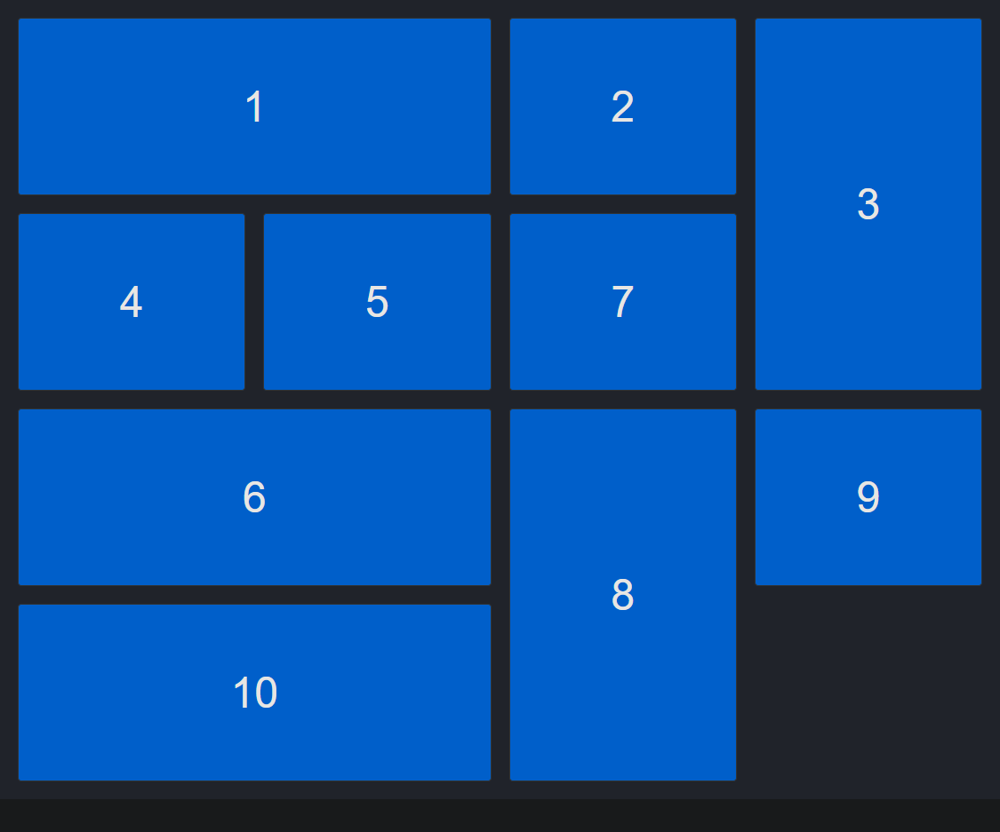

## Grid CSS - Ejemplos

Este ejemplo sirve como guía para realizar un grilla de imagenes adaptable entre cualquier dispositivo como se muestra en la imagen siguiente.



Tu puedes ver el [ejemplo en funcionamiento aquí](https://wgarciamail.github.io/Grid-css-galeria-imagenes/grid-galery.html)


### Archivo html
```html
<!DOCTYPE html>
<html lang="en">
<head>
	<meta charset="UTF-8">
	<meta http-equiv="X-UA-Compatible" content="IE=edge">
	<meta name="viewport" content="width=device-width, initial-scale=1.0">
	<title>Grid gallery</title>
	<link rel="stylesheet" href="grid-galery.css">
</head>
<body>
	<div class="grid-container">
		<div class="grid-item wide">1</div>
		<div class="grid-item">2</div>
		<div class="grid-item tall">3</div>
		<div class="grid-item">4</div>
		<div class="grid-item">5</div>
		<div class="grid-item wide">6</div>
		<div class="grid-item">7</div>
		<div class="grid-item tall">8</div>
		<div class="grid-item">9</div>
		<div class="grid-item wide">10</div>
	</div>
</body>
</html>
```
### Archivo css
```css
.grid-item {
	display: flex;
	align-items: center;
	justify-content: center;
	background-color: #0379ff;
	border-radius: 4px;
	transition: transform 0.3s ease-in-out;
	border: solid 1px rgb(255, 255, 255);
}

.grid-item:hover{
	filter:opacity(0.9);
	transform:scale(1.04);
}

.grid-container{
	display: grid;
	grid-template-columns:repeat(auto-fill, minmax(250px, 1fr));
	grid-auto-rows: minmax(200px, auto);
	gap: 20px;
	padding: 20px;
	grid-auto-flow: dense;
}

@media (min-width: 600px) {
	.wide {
		grid-column: span 2;
	}

	.tall{
		grid-row: span 2;
	}
}

```
